[](LICENSE)
# Cryptography Toolbox 🔐


A multi-algorithm encryption and hashing GUI application built with Python and Kivy, featuring classical ciphers and modern cryptographic hashes.
There are 2 .py file one is an older version made in python and kivy labuage and the other file is written in pure python.
All the next update and the upcoming algorithms that are on the way will be applied only to the pure python file!

## Features ✨

- **Classical Ciphers**:
  - Caesar cipher encryption/decryption
  - Affine cipher encryption/decryption
  - Vigenère cipher encryption/decryption
- **Cryptographic Hashes**:
  - MD5 hashing
  - SHA-512 hashing
- **File Operations**:
  - Hash file contents
  - Compare file hashes
  - Store hashes to new files
- **Analysis Tools**:
  - Frequency analysis visualization
  - Hash verification

## Installation 📦

### Prerequisites
- Python 3.8+
- Kivy 2.0+
- Tkinter (for file dialogs)

```bash
# Clone the repository
git clone https://github.com/yourusername/cryptography-toolbox.git
cd cryptography-toolbox

# Install dependencies
    pip install kivy
    pip install matplotlib
    pip install numpy
    pip install tkinter
    pip install collections
    pip install hashlib
    pip install platform

# Run the application
python3 cryptography_app.py
```
## Cryptographic Components 🧩

### 🔐 Encryption Algorithms

| Algorithm  | Key Requirements             | Notes                          | Security Level |
|------------|------------------------------|--------------------------------|----------------|
| **Caesar** | Single integer (1-25)        | Only alphabetic characters     | ⚠️ Low         |
| **Affine** | Two integers (a, b)          | 'a' must be coprime with 26    | ⚠️ Low         |
| **Vigenère**| Text key (case-sensitive)    | Polyalphabetic substitution    | ⚠️ Medium-Low  |

> **Note**: These classical ciphers are for educational purposes only. Not secure for modern cryptographic needs.

### 🔍 Hash Functions

| Function   | Output Size | Collision Resistance | Speed | Common Uses |
|------------|------------|----------------------|-------|-------------|
| **MD5**    | 128-bit    | ❌ Broken            | ⚡ Fast | File integrity checks, checksums |
| **SHA-512**| 512-bit    | ✅ Strong            | ⏳ Slow | Secure password storage, digital signatures |

> **Security Advisory**: MD5 should not be used for security-sensitive applications.

### Visual Comparison

```mermaid
graph TD
    A[Encryption Algorithms] --> B[Caesar]
    A --> C[Affine]
    A --> D[Vigenère]
    E[Hash Functions] --> F[MD5]
    E --> G[SHA-512]
```


Security Notice ⚠️
Important:

Classical ciphers (Caesar, Affine, Vigenère) are not secure for modern cryptographic needs

MD5 is considered broken for security purposes

Use SHA-512 for cryptographic applications

This tool is for educational purposes only

# ==============================
# Hashing Algorithms (one-way)
# Used for passwords, checksums, and integrity verification
# ==============================

SHA-512        # Strong, widely used, secure
SHA-384        # Variant of SHA-512, shorter output
SHA-256        # Standard secure hash, widely supported
SHA-3-512      # Modern SHA-3 standard
SHA-3-256      # Modern SHA-3 standard
BLAKE2b        # Very fast, secure, alternative to SHA-2/3
BLAKE2s        # Fast, for smaller outputs
RIPEMD-160     # Legacy but secure hash
Whirlpool      # 512-bit hash, strong
SHA-1          # Legacy, not recommended for security-critical use
MD5            # Broken, only for non-security checksums

# ==============================
# Symmetric Encryption Algorithms (two-way)
# Used for encrypting/decrypting files or data
# ==============================

AES-256-CBC    # Strong, standard, recommended
AES-192-CBC    # Secure, less common
AES-128-CBC    # Moderate security, fast
ChaCha20       # Modern, fast, secure, mobile-friendly
Twofish        # AES alternative, secure
Camellia       # AES alternative, strong
3DES           # Legacy, moderate security
DES            # Legacy, weak, not recommended
Blowfish       # Legacy, moderate security
CAST-128       # Moderate security, faster than DES

# ==============================
# Asymmetric Encryption Algorithms (public-key)
# Used for key exchange, digital signatures
# ==============================

RSA            # Classic, secure with 2048+ bit keys
ECC            # Elliptic Curve Cryptography, modern, small keys
ElGamal        # Secure, less common
DSA            # Signing only, legacy use

# ==============================
# Message Authentication / Keyed Hash
# Used for verifying integrity and authentication
# ==============================

HMAC-SHA256    # Standard keyed hash for integrity
HMAC-SHA512    # Stronger keyed hash
Poly1305       # Often used with ChaCha20 (ChaCha20-Poly1305)
CMAC-AES       # AES-based MAC, secure alternative to HMAC
