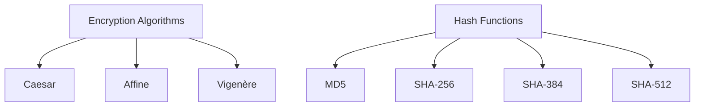

[](LICENSE)
# Cryptography Toolbox


A multi-algorithm encryption and hashing GUI application built with Python and Kivy, featuring classical ciphers and modern cryptographic hashes.  
There are 2 .py file one is an older version made in python and kivy language and the other file is written in pure python.  
All the next updates and the upcoming algorithms that are on the way will be applied only to the pure python file!

## Features

- **Classical Ciphers**:
  - Caesar cipher encryption/decryption
  - Affine cipher encryption/decryption
  - Vigenère cipher encryption/decryption
- **Cryptographic Hashes**:
  - MD5 hashing
  - SHA-512 hashing
  - SHA-384 hashing
  - SHA-256 hashing
- **File Operations**:
  - Hash file contents
  - Compare file hashes
  - Store hashes to new files
- **Analysis Tools**:
  - Frequency analysis visualization
  - Hash verification

## Installation

### Prerequisites
- Python 3.8+
- Kivy 2.0+
- Tkinter (for file dialogs)

```bash
# Clone the repository
git clone https://github.com/GEPD2/encryption_app.git
cd encryption_app

# Install dependencies
pip install kivy
pip install matplotlib
pip install numpy
(No need to pip install standard libraries like tkinter, collections, or hashlib — they’re already included with Python.)

or you can do this to install all the nesessary labraries at once
pip install -r required_libraries.txt
```
Run the application
python3 cryptography_app_pure_python.py

## Cryptographic Components

### Encryption Algorithms

| Algorithm   | Key Requirements             | Notes                          | Security Level |
|-------------|------------------------------|--------------------------------|----------------|
| **Caesar**  | Single integer (1-25)        | Only alphabetic characters     | ⚠️ Low         |
| **Affine**  | Two integers (a, b)          | 'a' must be coprime with 26    | ⚠️ Low         |
| **Vigenère**| Text key (case-sensitive)    | Polyalphabetic substitution    | ⚠️ Medium-Low  |

**Note**: These classical ciphers are for educational purposes only. Not secure for modern cryptographic needs.

### Hash Functions

| Function    | Output Size | Collision Resistance | Speed | Common Uses |
|-------------|-------------|----------------------|-------|-------------|
| **MD5**     | 128-bit     | ❌ Broken            | ⚡ Fast | File integrity checks, checksums |
| **SHA-256** | 256-bit     | ✅ Strong            | ⚡ Fast | Secure password storage, digital signatures |
| **SHA-384** | 384-bit     | ✅ Strong            | ⏳ Medium | Secure password storage, digital signatures |
| **SHA-512** | 512-bit     | ✅ Strong            | ⏳ Slow | Secure password storage, digital signatures |

> **Security Advisory**: MD5 should not be used for security-sensitive applications.

### Visual Comparison


Security Notice ⚠️
Classical ciphers (Caesar, Affine, Vigenère) are not secure for modern cryptographic needs

MD5 is considered broken for security purposes

Use SHA-256 / SHA-384 / SHA-512 for cryptographic applications

This tool is for educational purposes only

Hashing Algorithms (one-way)
(Supported / planned)

SHA-512 # Strong, widely used, secure

SHA-384 # Variant of SHA-512, shorter output

SHA-256 # Standard secure hash, widely supported

SHA-3-512 # Modern SHA-3 standard

SHA-3-256 # Modern SHA-3 standard

BLAKE2b # Very fast, secure, alternative to SHA-2/3

BLAKE2s # Fast, for smaller outputs

RIPEMD-160 # Legacy but secure hash

Whirlpool # 512-bit hash, strong

SHA-1 # Legacy, not recommended for security-critical use

MD5 # Broken, only for non-security checksums
