[](LICENSE)
# Cryptography Toolbox 🔐


A multi-algorithm encryption and hashing GUI application built with Python and Kivy, featuring classical ciphers and modern cryptographic hashes.

## Features ✨

- **Classical Ciphers**:
  - Caesar cipher encryption/decryption
  - Affine cipher encryption/decryption
  - Vigenère cipher encryption/decryption
- **Cryptographic Hashes**:
  - MD5 hashing
  - SHA-512 hashing
- **File Operations**:
  - Hash file contents
  - Compare file hashes
  - Store hashes to new files
- **Analysis Tools**:
  - Frequency analysis visualization
  - Hash verification

## Installation 📦

### Prerequisites
- Python 3.8+
- Kivy 2.0+
- Tkinter (for file dialogs)

```bash
# Clone the repository
git clone https://github.com/yourusername/cryptography-toolbox.git
cd cryptography-toolbox

# Install dependencies
    pip install kivy
    pip install matplotlib
    pip install numpy
    pip install tkinter
    pip install collections
    pip install hashlib
    pip install platform

# Run the application
python3 cryptography_app.py
```
## Cryptographic Components 🧩

### 🔐 Encryption Algorithms

| Algorithm  | Key Requirements             | Notes                          | Security Level |
|------------|------------------------------|--------------------------------|----------------|
| **Caesar** | Single integer (1-25)        | Only alphabetic characters     | ⚠️ Low         |
| **Affine** | Two integers (a, b)          | 'a' must be coprime with 26    | ⚠️ Low         |
| **Vigenère**| Text key (case-sensitive)    | Polyalphabetic substitution    | ⚠️ Medium-Low  |

> **Note**: These classical ciphers are for educational purposes only. Not secure for modern cryptographic needs.

### 🔍 Hash Functions

| Function   | Output Size | Collision Resistance | Speed | Common Uses |
|------------|------------|----------------------|-------|-------------|
| **MD5**    | 128-bit    | ❌ Broken            | ⚡ Fast | File integrity checks, checksums |
| **SHA-512**| 512-bit    | ✅ Strong            | ⏳ Slow | Secure password storage, digital signatures |

> **Security Advisory**: MD5 should not be used for security-sensitive applications.

### Visual Comparison

```mermaid
graph TD
    A[Encryption Algorithms] --> B[Caesar]
    A --> C[Affine]
    A --> D[Vigenère]
    E[Hash Functions] --> F[MD5]
    E --> G[SHA-512]
```


Security Notice ⚠️
Important:

Classical ciphers (Caesar, Affine, Vigenère) are not secure for modern cryptographic needs

MD5 is considered broken for security purposes

Use SHA-512 for cryptographic applications

This tool is for educational purposes only
